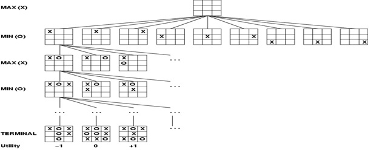
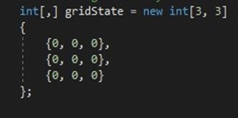
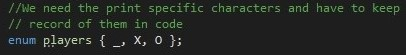
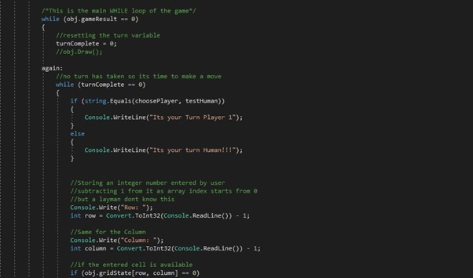
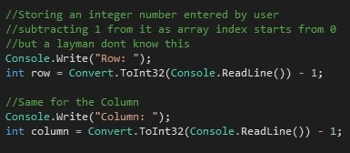
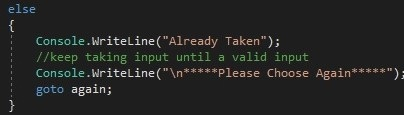
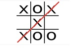
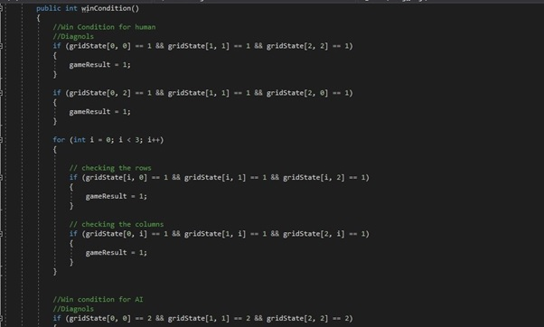
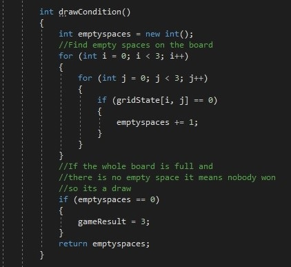
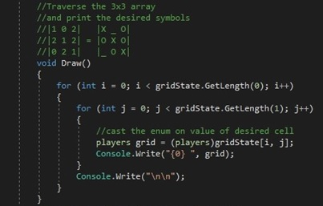

# Introduction

Artificial Intelligence can be defined as an intelligence exhibited by an artificial entity. Traditionally machines are considered dumb as they cannot perform tasks but with the dawn of AI this narrative can be changed. Machines can think, process information and can make decisions on them in accordance to the situation they are in. today artificial intelligence is making mark in almost all walks of life and is destined to grow.

## Games and AI

Artificial Intelligence is being used in games to exhibit human like intelligence in computer players. A popular term ‘Game Theory’ is used in AI, Game theory is a branch of mathematics that is used to develop strategic relations between different players in context of predefined rules and outcomes. Artificial Intelligence is being applied to traditional board games like tic tac toe to today’s world modern video games.
Many Algorithms are used to implement AI in games. Algorithms are set of unambiguous instructions that a computer can understand. We can use these algorithms where we know that data set is not so big and the problem is highly regulated.

## Tic Tac Toe

Tic tac toe is a game people usually play on paper or board with their friends. This game has simple unambiguous rules
•	It is a two-player game
•	It is usually played on a 3x3 grid that contains 9 cells.
•	One player is ‘X’ and another player is ‘O’.
•	First player to place their 3 marks either in a row, column or diagonally, wins.
•	Game can be concluded in two ways either someone place their 3 marks and win or all 9 cells of board get filled.

This is a strategy game where you have to look how to get your three marks in a row/columns/diagonal and simultaneously have to keep an eye on your opponent moves to leave them with least productive choices.

### What is the Problem?

We are going to make a computer tic tac toe game, that contains two players mainly a human and an artificial intelligent agent. We have solved this problem from the perspective of AI agent. Our computer agent has to calculate the best move based on the current condition of the game.

### How to Solve this?

###### Algorithm

To solve this classic tic tac toe game, we have used Minimax Algorithm, first proved by John von Neumann in 1928. It is a recursive or a backtracking algorithm.

This algorithm traverses the whole game tree, by filling it up with different scenarios and then assign value to the moves. Another important point is that this algorithm finds the optimal value considering the opponent is playing their optimal moves too but, in our case, if the opponent does not play its optimal move it will still work out in our favour and by our I meant AIs favour.

Minimax algorithm consist of two layers a maximizing layer and a minimizing layer. We as an AI are the maximizing the layer trying to the find the maximum score we can get from certain moves and for minimizing layer we are trying to minimize the score. So, the algorithm is working on two extreme parts maximize the score for AI and minimize the score for opponent.

### How to implement in this code?

To implement this classic game, we have to learn the game and its rules. As we discussed earlier this game is usually played on 3x3 grid, so to implement this in code we have to take two-dimensional array such as:

And initialize it with zeros that represent that all our nine cells are empty as of now.

We have to represent our players as X, O or a _ for empty space, for this purpose we have used an enum that contains these three states

This whole game works with a loop, the main WHILE loop with a terminating condition of till the game ends. For the termination condition we have to assign a variable that holds the value of current state of game.

Then we implement our game with this while loop and terminating condition. In my case I have given the human user an advantage of making the first move

To carry out the first move of human player I have again used a while loop with the termination condition of a variable that stores the value if the move have been taken or not
Then we take input from user as row and a column of their desired cell as 

But for the sake of convenience I have subtracted 1 from the user input value as our grid will have rows and columns numbered 0,1,2 but for a layman first row or column should be 1 not 0.

After storing these values, I have check condition if the desired cell is empty or not if its empty, I have written the user move in its desired cell. And for the else condition if it is not available a goto statement is used that takes back the user to inputs again with displaying a message that given cell is not available

After the move is taken we changed the turn variable and call the draw function that draws the new gridstate with the value user entered then we check if our board has met the win condition or the draw condition to get out of main game while loop as we have taken the turn we come out of the second while loop and again check if the game is going on has ended if the game is still going on we give turn the second player. Second player makes it moves and the game keep on going until we meet the main while loop terminating condition.

Initially when I was developing the game for computer player, I generated random number between 0-2 for rows and columns and then applied the same principle whether that cell is available or not if available move computer mark to that spot. And added a goto statement that will keep on generating random cells until it founds the cell available. And after computer taking its turn draw the board check win and draw condition.

After the both players have taken their turn, we check the game result variable and according to its value we display the required message on screen.
This is the end of main function.

### Functions i used

I have used a winConditon function that check our array for win condition that in our case, tic tac toe is three similar marks in row, column or diagonals.

We have a Draw function that check the array for empty spaces if it does not found any empty states, that means that whole board is full and we called win condition before that means nobody won either, so if nobody won and board is full it mean game is a draw.

We have function to draw the board, it simply traverses the 2d array and print their value with casting of enum for example 1 for X, 2 for 0 and 3 for _.

### Evaluation Function:

Then we have an evaluation function that assign value to given state of our board that’s checks for the similar mark and if it founds one it assigns value to it for maximizing player and minimizing player

1 for win, -1 for loss and 0 for draw.

Then we check if we have any available move by checking the empty spaces in array.

### Some Tweaks

Some changes made along the development process to game time to time. At first, I developed the simple tic tac toe game. By experimenting I reached a point where I could take input from player 1 and player 2 and can get back to second turn of the players if the game has not ended yet. For second player I used random function, that generated moves for the computer. After some work I was able to make a two-player tic tac toe game that has two players one as a human and other one the computer itself. But still there was some work to do as my game was working but it was not intelligent. For this I had to implement the minimax algorithm that could calculate the best moves instead of making random moves. Then I learned assigning scores to the game tree, how you can solve tree structures with recursion etc. Then I was able to make it work but it was not super intelligent, I could still beat it sometimes. So, I reworked on my algorithm read about minimax more and was able to find small mistakes in my code such as less than operator in place of greater than sign, false instead of true but finally it was working and did great. Then I worked more on this project and created two version human vs human and human vs AI. For AI I could use my previously created random moves algorithm disguised as weak AI and my minimax algorithm as Strong AI. So, I implemented this.

In future maybe I will make changes to this project by allowing user to pick their mark either they want to choose X or O. or add another level of medium AI as I know my minimax code has some point where I can make changes and can make it weak but it will still be working better than randomized approach. Or what if we create 15x15 grid of tic tac toe with same rules but put two AIs against each other?

